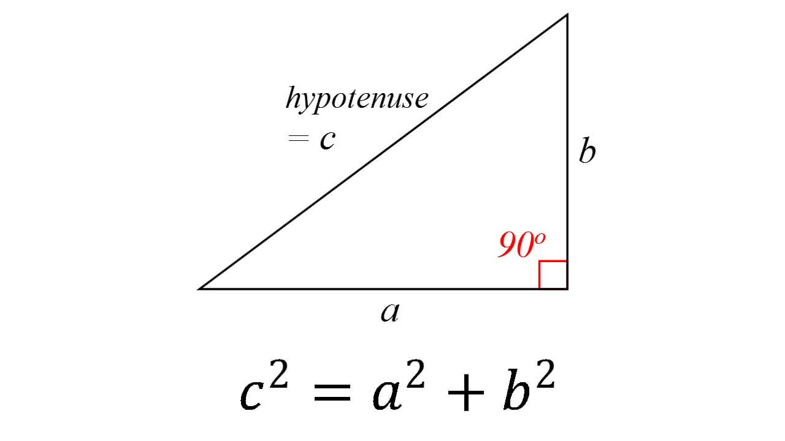
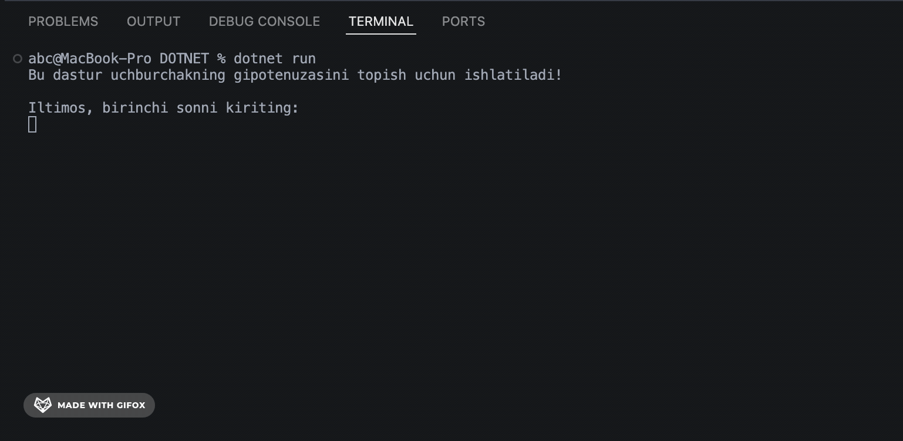

# GeometryGuru

## Pifagor teoremasi
dasturlashdagi ilk matematik hisob-kitoblarni o'rganish uchun eng klassik misollardan biri hisoblanadi.

Bu topshiriqda biz foydalanuvchidan uchburchakning ikkita tomonini so'raymiz va uchinchi tomonni (gipotenuzani) hisoblaymiz.
To'g'ri burchakli uchburchakda gipotenuza (c) quyidagi formula orqali topiladi:

1. Foydalanuvchi uchburchakning 2ta katet raqamini kiritadi.
2. Dastur formula orqali Uchburchak gipotenuzasini hisoblab natijani ekranga chiqaradi.

